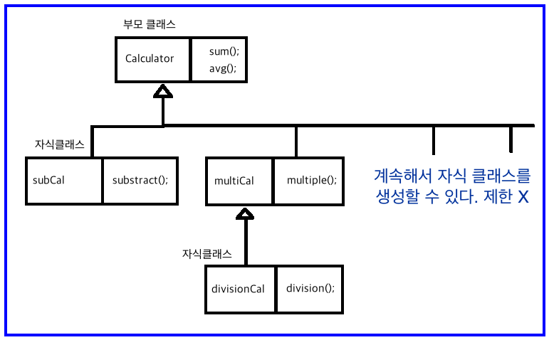
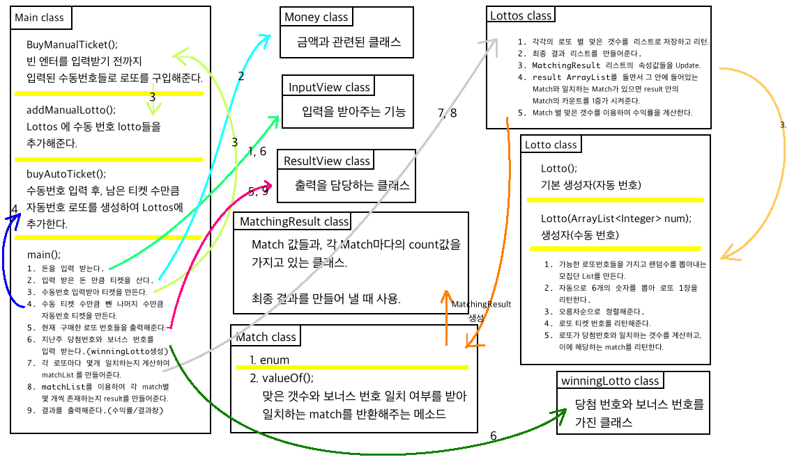

# (2017.12.13)

## TIL

1. JAVA 상속

  1-1) 상속이란 ?

  1-2) 그렇다면 어떻게 사용해야 하는가?

  1-3) 상속과 생성자

2. lotto 코드에서의 적용

  2-1) 현재 lotto 코드 분석

  2-2) lotto 코드 수정 (상속 사용)

---
### 1. JAVA 상속

### 1-1) 상속이란 ?
- 상속은 객체지향에서 아주 중요한 개념이다.

- 객체지향을 통해서 달성하고자 하는 목표 중에서 가장 중요한 것은 재활용성일 것이다.

- 상속은 객체지향의 재활용성을 극대화시킨 프로그래밍 기법이다.
  (동시에 객체지향을 복잡하게 하는 주요 원인이라고도 할 수 있다.)

- 상속이란 물려준다는 의미이다. 어떤 객체가 있을 때 그 객체의 필드(변수)와 메소드를 다른 객체가
  물려 받을 수 있는 기능을 상속이라고 한다.

- 코드의 중복을 제거할 수 있다. 재활용성이 높다. 유지보수가 편리하다. 하지만 복잡도가 증가한다.
  (가독성과 복잡도는 상관관계가 없다. 복잡도는 증가하지만, 가독성은 올라간다.)

- 부모클래스 = 상위클래스 = super클래스
- 자식클래스 = 하위클래스 = sub클래스

---
### 1-2) 그렇다면 어떻게 사용해야 하는가 ?
- 코드를 보면서 이해하자.

```JAVA
//부모 클래스 Calculator
class Calculator {
  int left, right;

  public void setOprands(int left, int right) {
    this.left = left;
    this.right = right;
  }

  public void sum() {
    System.out.println(this.left + this.right);
  }

  public void avg() {
    System.out.println((this.left + this.right) / 2);
  }
}
//뺄셈이 가능한 자식 클래스
class subCal extends Calculator {
  public void substract() {
    System.out.println(this.left - this.right);
  }
}
//곱셈이 가능한 자식 클래스
class multiCal extends Calculator {
  public void multiple() {
    System.out.println(this.left * this.right);
  }
}
//나눗셈이 가능한 자식 클래스
class divisionCal extends multiCal {
  public void division() {
    System.out.println(this.left / this.right);
  }
}
//메인
public static void main(String arg[]) {
  divisionCal c1 = new divisionCal();

  c1.setOprands(10, 20);
  c1.sum();
  c1.avg();
  c1.substract();
  c1.multiple();
  c1.division();
}
```

> 이렇듯 `extends` 를 이용하여 상속을 할 수 있다. 상속을 이용하여 가장 하위 클래스인
  `divisionCal` 의 인스턴스 `c1` 은 상위 부모 클래스들의 기능을 사용할 수 있지만,
  `subCal` 의 기능은 사용할 수 없다. 이유는 아래의 그림을 보면 이해하기 쉽다.

 

- 그림에서 보면 `divisionCal` 의 인스턴스인 `c1` 은 `subCal` 과는
  아무 연관성이 없다. `Calculator` 의 자식인 `multiCal` 의 자식클래스 이기 때문에
  `Calculator` 와 `multiCal` 의 인스턴스와 메소드를 가지고 있는 것이다.

---
### 1-3) 상속과 생성자

- 부모 클래스에서 생성자를 만들었는데, 자식 클래스에서 같은 생성자를 만들 경우,
  이것은 코드 중복이다.

- 같은 기능을 하는 생성자라면, 자식 클래스에서 한번에 부모클래스의 생성자를 당겨와서
  사용하면 중복을 없앨 수 있다.

- 이에 사용하는 것이 바로 `super()` 이다.

- 그림에서 볼 때, multiCal 인스턴스를 만들 때,

 ```JAVA
 class multiCal extends calculator {
   public multiCal(int left, int right) {
     super(left, right);
   }
 }
 ```
 이렇게 만들면, left,right를 이용해서 부모클래스의 생성자를 호출한다는 뜻이다.

- 이를 사용하여 부모클래스와 자식클래스 간의 코드 중복을 없앨 수 있다.
- `super()` 이외에 더 추가로 초기화 해야하는 것들은 무조건 `super()` 뒤에 작성한다.
  예를 들어,

  ```JAVA
  class multiCal extends calculator {
    public multiCal(int left, int right, int middle) {
      super(left, right);
      this.middle = middle;
    }
  }
  ```
  와 같은 식으로 작성해야 한다. `super()` 위에 작성하게 되면 error가 발생할 수 있다.

---
### 2. lotto 코드에서의 적용

### 2-1) 현재 lotto 코드 분석

- 먼저 현재의 코드가 어떻게 작동하는지 확인하고, 상속을 줄 수 있는 부분을 찾는것이
  필요하다.
 - 현재 대략적인 구조는 그림과 같다.
 

 - 구조를 정리해 보면서 Lotto클래스 내에 수동번호 생성하는 것이
   winningLotto 클래스의 부모 클래스가 될 수 있다고 판단했다.

---
### 2-2) lotto 코드 수정 (상속 사용)

#### Lotto 클래스 2개로 분리 (수동번호가 lotto / 자동번호는 lotto 클래스를 상속받는다.)

1) lotto 클래스는 수동 번호만 받도록.

```JAVA
package lotto;

import java.util.ArrayList;

public class Lotto {
	protected ArrayList<Integer> num = new ArrayList<Integer> ();
	//수동 번호 로또를 생성해주는 생성자.
	public Lotto(ArrayList<Integer> num) {
		this.num = num;
	}
	//각 로또 티켓마다의 번호를 확인하는 (리턴하는) 메소드.
	public ArrayList<Integer> getNum() {
		return this.num;
	}
	//각 티켓마다 winningNum과 일치하는 숫자의 수를 계산하고, 일치하는 숫자의 수에 해당하는 match를 리턴한다.
	public Match matchCount(WinningLotto winningLotto) {
		int count = 0;
		ArrayList<Integer> winningNum = winningLotto.getNum();
		for (int i = 0; i < winningNum.size(); i++) {		//보너스 번호를 제외한 6개의 숫자만 비교하여 몇개 일치하는지 리턴해준다.
			count += findToMatch(winningNum.get(i));
		}
		return makeRank(count, winningLotto.getBonusNum());
	}
	//winningNum의 숫자가 티켓 안에 있다면 1을 리턴, 없다면 0을 리턴. (상위 메소드에서 count값을 증가시키기 위함)
	private int findToMatch(int winningNum) {
		if (this.num.contains(winningNum)) {
			return 1;
		}
		return 0;
	}
	//맞은 갯수를 가지고 등수로 변환시켜주는 메소드.
	private Match makeRank(int count, int bonus) {
		Match match = Match.valueOf(count, this.num.contains(bonus));		//맞은 갯수와 보너스 번호가 일치하는지 여부를 보내서 일치하는 Match를 불러온다.
		return match;		//그 Match 를 받아와서 리턴한다.
	}
}
```

2) 자동번호는 AutoLotto 클래스 생성 후 Lotto 를 상속받도록.

```JAVA
package lotto;

import java.util.ArrayList;
import java.util.Collections;

public class AutoLotto extends Lotto {
	//자동 번호 로또를 생성해주는 생성자.
	public AutoLotto() {
		super(selectAutoNum());
	}

	//가능한 모든 로또 번호들을 List에 넣어서, 랜덤 수를 뽑아내는 모집단 List를 만든다.
	private static ArrayList<Integer> makeTotalNum () {
		ArrayList<Integer> numCollection = new ArrayList<Integer> ();
		for (int i = 1; i <= 45; i++) {
			numCollection.add(i);
		}
		return numCollection;
	}
	//자동으로 6개의 숫자를 뽑아 로또 티켓 1장을 리턴한다.
	private static ArrayList<Integer> selectAutoNum () {
		ArrayList<Integer> totalNumList = makeTotalNum();
		ArrayList<Integer> ticket = new ArrayList<Integer> ();
		Collections.shuffle(totalNumList);		//무작위로 모집단 수를 섞는다.
		ticket.addAll(totalNumList.subList(0,6));		//0번째에서 5번째까지만 추출한다.
		ticket = sortAutoNum(ticket);		//6개의 뽑힌 숫자를 정렬한다. (오름차순)
		return ticket;
	}
	//오름차순으로 숫자를 정렬해주는 메소드.
	private static ArrayList<Integer> sortAutoNum(ArrayList<Integer> ticket) {
		Collections.sort(ticket);
		return ticket;
	}
}
```

3) WinningLotto 도 Lotto 를 상속받도록.

```JAVA
package lotto;

import java.util.ArrayList;

public class WinningLotto extends Lotto {
	private int bonus;

	//생성자.
	public WinningLotto(ArrayList<Integer> winningNum, int bonus) {
		super(winningNum);
		this.bonus = bonus;
	}
	//보너스 번호를 리턴.
	public int getBonusNum() {
		return bonus;
	}
}
```

4) Main 에서도 자동 수동 나눠서 호출.

```JAVA
package lotto;

import java.util.ArrayList;


public class Main {
	//제대로 된 번호를 입력받는 만큼 수동번호 티켓을 만들어주는 메소드. (총 만들어진 티켓모두를 리턴한다.)
	private static Lottos buyManualTicket (int ticketNum) {
		System.out.println("수동으로 구매하실 번호를 입력해 주세요. 숫자 사이에는 ,와 (스페이스바)를 입력해주세요.");
		System.out.println("수동 입력이 끝나면 'ENTER'를 눌러주세요.");
		Lottos lottos = new Lottos();
		int count = ticketNum;
		ArrayList<String> input = new ArrayList<String> ();

		do {
			input = InputView.inputManualNum();		//수동 번호를 입력 받는다.(String형으로)
			lottos = addManualLotto(input, lottos);		//수동 로또를 추가한다.
			count--;
		}while (!input.isEmpty() && count > 0);
		return lottos;
	}
	//수동 번호 로또를 추가해주는 메소드.
	private static Lottos addManualLotto(ArrayList<String> input, Lottos lottos) {
		if (!input.isEmpty()) {
			lottos.add(new Lotto(InputView.convertInput(input)));
			return lottos;
		}
		return lottos;
	}
	//입력받은 티켓의 수만큼 자동번호 티켓을 만들어주는 메소드. (총 만들어진 티켓모두를 리턴한다.)
	private static Lottos buyAutoTicket (Lottos lottos, int ticketNum) {
		for (int i = 0; i < ticketNum; i++) {
			lottos.add(new AutoLotto());
		}
		return lottos;
	}

	//===========================MAIN START===============================
	public static void main (String[] args) {
		Money money = new Money(InputView.takeMoney());		//돈을 입력 받는다.

		int lottoTicketNum = money.buyLotto();

		Lottos lottos = buyManualTicket(lottoTicketNum);		//수동으로 번호를 입력받아 티켓을 만든다.
		int manualTicketNum = lottos.get().size();		//수동으로 만든 티켓의 갯수.

		lottoTicketNum = lottoTicketNum - manualTicketNum;
		ResultView.printAutoOrManual(manualTicketNum, lottoTicketNum);

		lottos = buyAutoTicket(lottos, lottoTicketNum);		//남은 티켓 수만큼 자동 티켓을 만들어 준다.

		ResultView.printTicket(lottos);

		ArrayList<Integer> winningNum = InputView.inputNum();		//지난 주 당첨 번호를 입력 받는다.
		int bonusNum = InputView.takeBonusNum();
		WinningLotto winningLotto = new WinningLotto(winningNum, bonusNum);

		ArrayList<Match> matchList = lottos.makeMatchList(winningLotto);
		ArrayList<MatchingResult> result = lottos.makeResult();

		Lottos.fillResult(matchList, result);		//당첨 번호들을 가지고 최신 result 로 채워준다.(Update해준다.)

		double profit = lottos.calculateMoney(result, money);		//번 돈과 투자한 돈을 가지고 수익률을 계산한다.

		ResultView.printResult(result);
		ResultView.printProfit(profit);
	}
}
```
