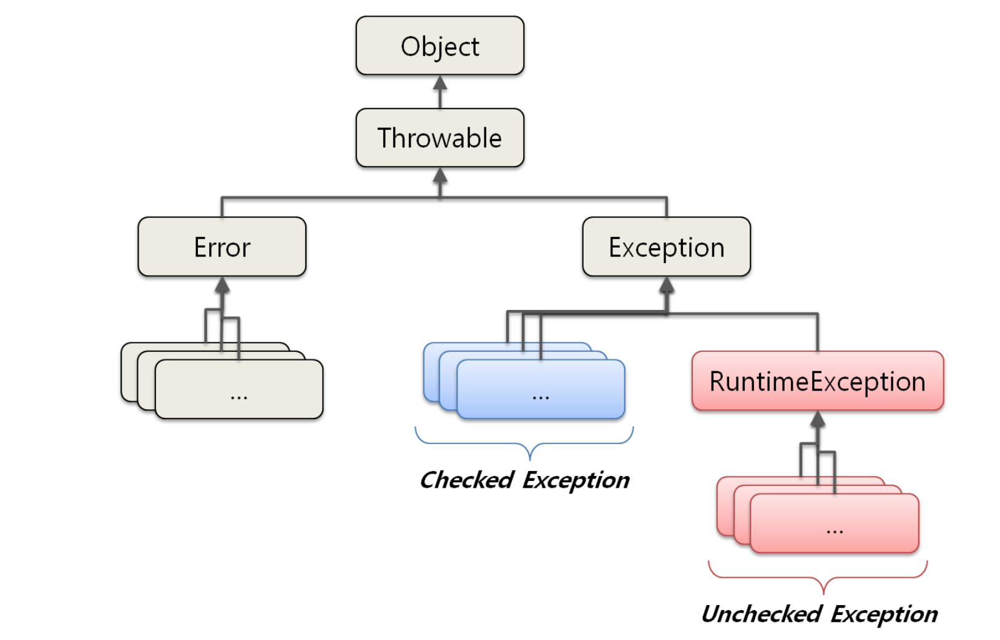
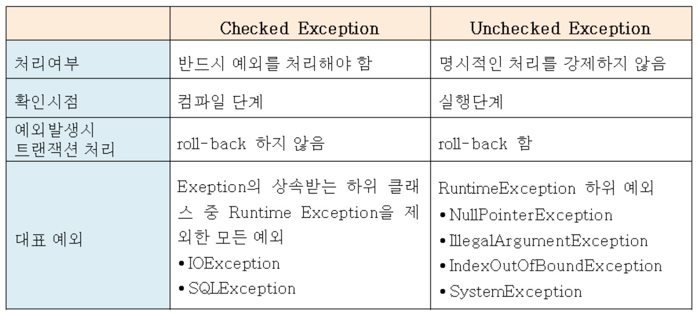

# (2017.12.27)

## TIL

1. JAVA의 EXCEPTION (예외 처리)

---
### 1. JAVA의 EXCEPTION (예외 처리)

### 1) 예외(EXCEPTION) 의 개념

`예외(EXCEPTION)`는 일종의 오류 이고, 크게 두가지로 나눌 수 있다.

1) `문법 오류` : 오타와 같이 자바 구문에 어긋난 코드 때문에 발생하고,
    컴파일시에 발생하는 오류

2) `실행 오류` : 프로그램 실행시 상황에 따라 발생하는 오류

> - `실행 오류`에는 **프로그램 자체의 구조적인 문제** 로 인한 `논리적 오류` 와
  자바 가상 머신 자체의 문제로 인한 오류 그리고 `예외` 가 있다.

> - `논리 오류`는 논리적 모순이 생기지 않도록 코딩하는 수밖에 없으며,
  자바 가상 머신 자체의 오류는 *프로그래머가 책임질 수 있는 수준의 오류가 아니다.*

> - `예외` 는 프로그램 실행 중에 발생할 수 있는 예기치 않은 사건으로
  프로그래머의 노력으로 처리할 수 있다.

---
### 2) 예외(EXCEPTION) 클래스
- 자바의 예외는 java.lang.Throwable 클래스의 하위 클래스인 `java.lang.Exception`
  클래스에서 취급한다.

 (그림 1) 예외클래스의 구조

 (그림 2) checked / unchecked

- `체크예외` : Exception 클래스의 서브클래스이면서 RuntimeException 클래스를
   상속하지 않은 것들

- `언체크예외` : RuntimeException을 상속한 클래스

- 예외의 예 들

 - ArithmeticException : 산술 연산 오류 (정수를 0으로 나누는 경우)

 - IndexOutOfBoundsException : 배열의 인덱스가 배열의 길이를 넘을 때

 - IllegalArgumentException : 메소드의 매개변수 유형을 잘못 사용할 때

 - IOException : 입출력시에 지정한 파일이 시스템에 존재하지 않을 때

  > 물론 Exception의 종류는 훨씬 많이 있다.

---
### 3) 예외(EXCEPTION) 의 종류와 특징
자바에서 throw를 통해 발생시킬 수 있는 예외는 크게 세 가지가 있다.

  *1) Error*

  > 첫째는 java.lang.Error 클래스의 서브클래스들이다.
  에러는 시스템에 뭔가 비정상적인 상황이 발생했을 경우에 사용된다.

  *2) Exception과 체크 예외*

  - 에러가 아닌 Exception 클래스는 체크 예외와 언체크 예외로 구분된다.

> 체크예외가 발생할 수 있는 메소드를 사용할 경우 반드시 예외를 처리하는 코드를
  함께 작성해야 한다.

> 사용할 메소드가 체크 예외를 던진다면 이를 catch 문으로 잡든지, 아니면 throws를 정의해서 메소드 밖으로 던져야 한다. 그렇지 않으면 컴파일 에러가 발생한다.

  *3) RuntimeException과 언체크/런타임 예외(RuntimeException)*

  > `java.lang.RuntimeException` 클래스를 상속한 예외들은 명시적인 예외처리를
  강제하지 않기 때문에 언체크 예외라고 불린다. 또는 대표 클래스 이름을 따서
  런타임 예외(RuntimeException)라고도 한다.

  > 에러와 마찬가지로 이 런타임 예외(RuntimeException)는 catch 문으로 잡거나
  throws로 선언하지 않아도 된다.

  > 런타임 예외는 주로 프로그램의 오류가 있을 때 발생하도록 의도된 것들이다.
  이런 예외는 코드에서 미리 조건을 체크하도록 주의 깊게 만든다면 피할 수 있다.
  피할 수 있지만 개발자가 부주의해서 발생할 수 있는 경우에 발생하도록 만든 것이
  런타임 예외이다.

---
