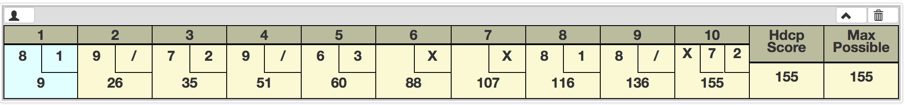
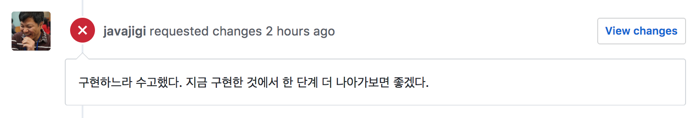

# (2018.01.05)

## TIL

1. JAVA BAWLING 구현에 필요한 `LINKED LIST`

2. 재귀 (RECURSION)

---
### 1. JAVA BAWLING 구현에 필요한 `LINKED LIST`

JAVA BOWLING 프로젝트를 진행하던 중, 먼저 볼링의 룰에 대해 공부 해야했다.


(IMAGE 출처 : http://www.bowlinggenius.com/)

- 먼저, 1 ~ 9 프레임 까지는 최대 2번의 try를 할 수 있다.

  - STRIKE 일때는 1번의 try 로 종료되고, 점수판에는 "X" 가 표기된다.

  - SPARE 는 첫번째 try 후에 남은 핀을 모두 쓰러트려야 발생하고, 점수판에는
    "첫번째점수 | /" 가 표기된다.

   > ex) `1 try : 7` `2 try : 3`

   > output : "7 | /"

  - SPARE 처리에 실패하면 두번째 try의 점수가 숫자로 표기되며, MISS가 나면 "-" 로 표기된다.

   > ex1) `1 try : 5` `2 try : 2`

   > output : `"5 | 2"` <- (Normal shot)

   > ex2) `1 try : 5` `2 try : 0`

   > output : `"5 | -"` <- (MISS)

- 10 프레임은 최대 3번의 try를 할 수 있다.
  - 앞 2번의 투구가 SPARE 처리가 되거나, 첫 투구시 STRIKE 일 때, 3번째 투구가 가능하다.

   > ex1) `1 try : 9` `2 try : 1`

   > output : `"9 | /"` --> 3번째 투구 가능

   > ex2) `1 try : 10`

   > output : `"X" --> 2번의 추가 투구 가능 (총 3번)

   > ex3) `1 try : 6` `2 try : 3`

   > output : `"6 | 3"`  --> 10프레임 종료 (3번째 투구 불가능)

- 점수 계산 방식에 대한 학습

 - SPARE 처리를 하지 못하면, 그 프레임의 점수는 그대로 끝이난다.
   > ex1) `1 try : 7` `2 try : 2`

   > frame score : 9

 - SPARE 처리를 한다면, 다음 1구를 더 굴리고, 그 점수까지 합산한다.
   > ex1) FRAME 1 :

   > `1 try : 7` `2 try : 3`

   > FRAME 2 :

   > `1 try : 5` `2 try : 3`

   > frame 1 score : 15

   > frame 2 score : 8

 - STRIKE 를 하게 되면, 다음 2구를 더 굴리고, 총 3개의 점수를 합산한다.
   > ex1) FRAME 1 :

   > `1 try : 10`

   > FRAME 2 :

   > `1 try : 5` `2 try : 3`

   > frame 1 score : 18

   > frame 2 score : 8

이를 바탕으로 볼링 게임을 구현하던 중, 점수 계산 부분에서 난관을 만났다.

나의 프로그램은 각각의 `frame` 들이 최대 2구 (10 frame은 3구) 의 점수를 가지고 있고,

그 `frame` 들을 하나로 묶어 `frames` 라는 객체로 관리하고 있었다.

하지만 각각의 frame에서 다음 frame의 정보를 가지고 있지 않았기 때문에, STRIKE와
SPARE처리가 된 점수를 계산하는 것은 `frames` 객체가 담당할 수 밖에 없었다.

하지만, 매 frame 들을 불러올 때마다 get() method를 이용해야 했기 때문에, 가독성이 나쁘고, 유지보수 하기에 굉장히 어려운 프로그램이 완성되었다.

이를 해결할 수 있는 방법은 매 frame들이 다음 frame에 대한 정보를 가지고 있게 하여,
`Linked list` 를 구성해야 했다.

이를 구현하기 위한 가장 좋은 방법은 ***재귀*** 였다.

---
### 2. 재귀 (RECURSION)

1. 재귀함수란?

 함수가 함수 내에서 자기 자신을 계속적으로 호출하는 방식이다.

 함수가 콜 되면서 최근에 자신을 부른 원래 함수가 스택에 차곡차곡 쌓이게 되는 방식이며,

 처음 불려진 함수에서(스택 맨 밑에있는 메소드) return 되는 값이 최종 return 값이 된다.

2. 재귀 구현 시 주의사항

 재귀는 반드시 `종료 조건` 을 만들어 주어야 한다. (그렇지 않으면 무한 루프!!)

3. 재귀 VS 일반
 성능으로 따졌을 때에는 일반 함수가 재귀 함수보다 높은 성능을 보인다.
 (충분히 큰 데이터를 다룰 때에)

 재귀 함수는 메모리 내에 stack을 계속해서 쌓아가기 때문에, 성능적인 측면에서는 떨어진다.

 - HONUX (정호영님) 에게 수업 들을때에 들은 말이 있다.
 > 재귀함수는 성능은 떨어지지만, 개발자의 두뇌 성장에는 뛰어나다.

 그만큼 생각해내기 어려운 (컴퓨터적인 사고를 해야하는) 개념이라고 생각된다.

4. 재귀를 이용한 후의 코드의 변화

 - 처음 코드를 짰을 때에 frames 클래스에서 아래와 같이 구현되었다.

```java
fillTotalScoreBoard(ArrayList<ArrayList<Integer>> result) {
		for (int i = 0; i < result.size(); i++) {
			if (getNullIndex(result.get(i)) == 1 && i < result.size() - 2) {
				if (getNullIndex(result.get(i+1)) == 1) {
					result.get(i).set(1, result.get(i+1).get(0));
					result.get(i).set(2, result.get(i+2).get(0));
				}
				result.get(i).set(1, result.get(i+1).get(0));
				result.get(i).set(2, result.get(i+1).get(1));
			}
			if (getNullIndex(result.get(i)) == 2 && i < result.size() - 1) {
				result.get(i).set(2, result.get(i+1).get(0));
			}
		}
		return result;
	}
}
```
> 코드를 보면 알 수 있듯이 너무나도 유지보수하기 힘든 코드다..

> 잠시 흡연을 하고 돌아오니 코딩한 나 자신 조차도 코드를 이해하기 힘들었다..

 - 재귀를 이용해 변경한 부분의 코드는 아래와 같다.

 frame에서 이렇게 nextFrame을 가지고 있고,
```java
public Frame addScore(int falledPin) {
		if (isNotEnd()) {
			pins.add(falledPin);
			return this;
		}

		if (this.frameNo == 9) {
			this.nextFrame = new FinalFrame(frameNo + 1);
			return nextFrame;
		}

		this.nextFrame = new Frame(frameNo + 1);
		return nextFrame;
	}
}
```

 이렇게 다음 프레임에서 이전 프레임의 점수를 받아 보너스점수 처리할 수 있도록 재귀함수를 이용했다.
```java
  public int makeFrameScore() {
		int frameScore = makeScore();
		Score score = new Score(frameScore, bonusTryNum());

		if (isPinClear() && nextFrame != null) {
			score = nextFrame.addBonusScore(score);
		}
		return score.getScore();
	}

	private Score addBonusScore(Score score) {
		int count = 0;
		while (!score.isEnded() && count < pins.size()) {
			score.bowl(pins.get(count));
			count++;
		}
		if (!score.isEnded() && nextFrame != null) {
			score = nextFrame.addBonusScore(score);    // <--recursion 이용
			return score;
		}
		return score;
	}

	private int makeScore() {
		int score = 0;
		for (Integer falledPin : pins) {
			score += falledPin;
		}
		return score;
	}

	private int bonusTryNum() {
		if (getStatus().isStrike()) {
			return 2;
		}
		if (getStatus().isSpare()) {
			return 1;
		}
		return 0;
	}
```

---
### 추가) 학습을 마치며 . .

사실 처음부터 Linked List 나 재귀를 생각했던 것은 아니다. 충분히 지저분한 하드코딩으로
시작했고, 어디부터 리팩토링 해나가야 할 지 감도 못잡고 있었다.

하지만, frame에서 다음 frame에 접근하지 못하는 것 때문에 최종 점수 계산이 힘들다는
사실은 인지하고 있었다. 이를 어떻게 적용해야 할 지에 대해서는 POBI (박재성 님) 의 도움이 컸다.



언젠가 POBI 에게 수제자로 인정받는 그날까지 계속해서 나를 채찍질 해야겠다..
