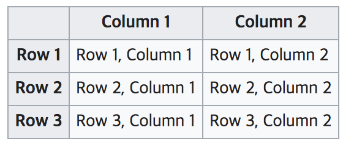
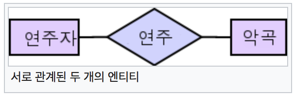

# (2018.01.22 ~ 2018.01.24)

## TIL

## 1. DB 없이 회원가입, 사용자 목록조회 기능 구현해보기
### 1-1) 학습 방향과 학습 방법
### 1-2) MVC 간단 설명 및 mustache 초간단 학습
### 1-3) 회원가입 기능 구현

## 추가) 데이터베이스(DB) 란 ?

## 2. DB를 사용해 데이터 저장하기 (반복주기 3-1)
### 2-1) 데이터베이스 설정
### 2-2) User 클래스 DB 테이블에 mapping
### 2-3) Controller 에서 repository 사용

## 3. 인증 기반 개발
### 3-1) 로그인 기능 구현
### 3-2) 로그인 상태에 따른 메뉴 처리 및 로그아웃
### 3-3) 자기 자신의 정보만 수정
### 3-4) 중복제거, clean code, 쿼리 보기 설정
### 3-5) 질문하기, 질문 목록 기능 구현

---
### 1-1) 학습 방향과 학습 방법

ㄱ) POBI(박재성 님)의 YOUTUBE 동영상을 보며 직접 따라해보기.

ㄴ) 리눅스 명령어 반복숙달

ㄷ) 서버 시작 및 종료 반복숙달

---
### 1-2) MVC 간단 설명 및 mustache 초간단 학습

1) 새로운 package 생성 및 내부에 class 생성. -> controller로 만들 예정.
- 컴파일러는 이 클래스가 컨트롤러인지 알 수 없다. 따라서 어노테이션을 달아주어야 한다.
> @Controller

- 이후에 command + shift + m 단축키로 import 한다. 이로써 컨트롤러 클래스로써의
역할 부여가 끝난다.

2) 이제 컨트롤러 클래스 안에 메서드를 만들어보자.

```java
package net.slipp.web;

import org.springframework.stereotype.Controller;

@Controller
public class WelcomeController {
	public String welcome() {
		return "welcome";
	}
}
```

이후에 static -> templates 안에 html 파일을 만들어준다. 이름은 welcome.html로 한다.

```html
<!DOCTYPE html>
<html>
<head>
<meta charset="UTF-8">
<title>Welcome</title>
</head>
<body>
Hello, World!
</body>
</html>
```

이렇게 만들어 준 뒤, 컨트롤러에 어떤 방식으로 저 html 파일을 띄워줄지에 대한 어노테이션을
달아준다.

```java
package net.slipp.web;

import org.springframework.stereotype.Controller;
import org.springframework.web.bind.annotation.GetMapping;

@Controller
public class WelcomeController {
	@GetMapping("/helloworld")
	public String welcome() {
		return "welcome";
	}
}
```
> @GetMapping 어노테이션을 달면 자동으로 GetMapping 이 import 된다.

컨트롤러에서 "welcome" 는 단순히 그 단어(String)가 아닌, welcome.html 을
리턴해준다는 의미로 변경된다. (뒤의 파일 형식까지 적어줄 필요 없다.)

이후 html 문서를 수정하여 출력되는 화면을 변경해주면 된다.
이 때, Model에 정보들을 담아서 출력해주는 방식은,

```java
package net.slipp.web;

import org.springframework.stereotype.Controller;
import org.springframework.ui.Model;
import org.springframework.web.bind.annotation.GetMapping;

@Controller
public class WelcomeController {
	@GetMapping("/helloworld")
	public String welcome(String name, int age, Model model) {
		System.out.println("name : " + name + ", age : " + age);
		model.addAttribute("name", name);
		model.addAttribute("age", age);
		return "welcome";
	}
}
```

```html
<!DOCTYPE html>
<html>
<head>
<meta charset="UTF-8">
<title>Welcome</title>
</head>
<body>
{{name}}, Hello, World!</br>
you are {{age}} years old.
</body>
</html>
```

와 같은식으로 구현하면 된다.

---
### 1-3) 회원가입 기능 구현

server로 data를 전달할 때에 html 문서 내에서 <\form> 태그를 사용한다.
<\form> 태그 안에는 action 속성을 부여할 수 있다. action 속성은 server에 요청을
보낼 때, 어떤 url 주소로 보낼건지에 대한 속성이다. 이는 아래와 같이 사용 가능하다.
> <\form action="/testpage">

---
### 추가) 그렇다면 데이터베이스(DB) 란 무엇인가?

구조화 되어있는 자료들을 모아놓은것이 바로 데이터베이스이다. 우리가 기존에 사용하던 엑셀도
일종의 데이터베이스 중 하나이다.

- 구조화 되어있는 데이터의 좋은점은 ?

	- 데이터를 정렬할 수 있다. (이름 별, 종류 별, 크기 별, 등등)
	- 데이터를 검색할 수 있다. (검색 조건에 의한 정렬가능)
	- 방대한 양의 데이터를 체계적으로 다룰 수 있다.

- 엑셀과의 차이점은 ?

	- `쿼리` 라는 것을 이용하여 여러가지 작업이 가능하다.
	> ex) select * from "tablename"

- 데이터베이스에서 알아야 할 용어들

	- 테이블
	> 테이블(table)은 세로줄과 가로줄의 모델을 이용하여 정렬된 데이터 집합(값)의 모임이다.

	- 칼럼
	> 컬럼(column)이란 관계형 데이터베이스 테이블에서 특정한 단순 자료형의 일련의 데이터값과 테이블에서의 각 열을 말한다. 컬럼은 열이 어떻게 구성되어야 할 지에 대한 구조를 제공한다. 관계형 데이터베이스 용어에서 컬럼과 같은 의미로 사용되는 것은 속성(attribute)이다.
	 

	- primary key(pk)
	> 기본 키(primary key)는 `주 키` 또는 `프라이머리 키` 라고 하며, 관계형 데이터베이스에서 조(레코드)의 **식별자로 이용하기에 가장 적합한 것** 을 관계 (테이블)마다 단 한 설계자에 의해 선택, 정의된 후보 키를 말한다.

	- foreign key(fk)
	> 외래 키(외부 키, Foreign Key)는 한 테이블의 필드(attribute) 중 다른 테이블의 행(row)을 식별할 수 있는 키를 말한다.

	- ERD
	> 개체-관계 모델(Entity-Relationship-Diagram)이란 구조화된 데이터에 대한 일련의 표현이다. 각 개체들 사이의 관계에 대한 그림을 표기하여 데이터를 모델링한다.
	 

	- 쿼리 또는 SQL(Structured Query Language)
	> 관계형 데이터베이스 관리 시스템(RDBMS)의 데이터를 관리하기 위해 설계된 특수 목적의 프로그래밍 언어이다.

	- CRUD(create, read or retrieve, update, delete)
	> CRUD는 대부분의 컴퓨터 소프트웨어가 가지는 기본적인 데이터 처리 기능인 Create(생성), Read(읽기), Update(갱신), Delete(삭제)를 묶어서 일컫는 말이다.

- What is ORM / JPA ?

	- ORM(Object Relational Mapping)은 자바 객체와 테이블 매핑을 통해 DB 쿼리를 손쉽게 도와주는 프레임워크이다.

	- JPA는 ORM(Object Relational Mapping) 표준 기술로 Hibernate, OpenJPA, EclipseLink, TopLink Essentials과 같은 구현체가 있고 이에 표준 인터페이스를 정의한 것이 JPA이다. 관계형 데이터베이스 연결, 쿼리 실행에 대한 표준을 정의한 것이 JDBC라면 JPA는 ORM에 대한 표준 인터페이스 정의이다.

	- Spring Data JPA 란, JPA를 좀 더 쉽게 사용할 수 있도록 도와주는 도구이다.

---
### 2-1) 데이터베이스 설정

의존관계 설정
- pom.xml에 다음 라이브러리에 대한 의존관계를 설정한다.

```html
<dependency>
    <groupId>org.springframework.boot</groupId>
    <artifactId>spring-boot-starter-data-jpa</artifactId>
</dependency>
<dependency>
    <groupId>com.h2database</groupId>
    <artifactId>h2</artifactId>
    <version>1.4.192</version>
</dependency>
```

DB connection 설정
- application.properties 에 DB connection 정보를 설정한다.

```java
spring.datasource.url=jdbc:h2:~/my-web;DB_CLOSE_DELAY=-1;DB_CLOSE_ON_EXIT=FALSE
spring.datasource.driverClassName=org.h2.Driver
spring.datasource.username=sa
spring.datasource.password=
spring.jpa.database-platform=org.hibernate.dialect.H2Dialect
```

---
### 2-2) User 클래스 DB 테이블에 mapping

User 클래스를 DB 테이블에 매핑하는 방법
- User 클래스를 DB 테이블에 매핑하면, DB 테이블은 별도로 생성할 필요없이 자동으로 생성된다.

- 방법

> 1) User 클래스를 @Entity로 설정한다.

> 2) User 클래스에 대한 유일한 key 값을 @Id로 매핑한다.

> 3) @Id에 @GeneratedValue 애노테이션을 추가하면 key가 자동으로 증가한다.

> 4) 각 필드를 테이블 칼럼과 매핑할 때는 @Column 애노테이션을 사용한다.

```java
import javax.persistence.Column;
import javax.persistence.Entity;
import javax.persistence.GeneratedValue;
import javax.persistence.Id;

@Entity
public class User {
    @Id
    @GeneratedValue
    private Long id;

    @Column(nullable=false, length=20)
    private String userId;

    private String password;
    private String name;
    private String email;

    [...각 필드에 대한 setter, getter method...]
}
```

---
### 2-3) Controller 에서 repository 사용

- 1) 사용자 데이터를 추가, 조회하기 위해 더 이상 ArrayList를 사용하지 말자.
`@Autowired 애노테이션` 을 활용해 UserRepository를 추가한다.

```java
@Controller
@RequestMapping("/users")
public class UserController {

  @Autowired
  private UserRepository userRepository;

  @PostMapping("")
  public String create(User user) {
    System.out.println("user : " + user);
    userRepository.save(user);
    return "redirect:/users";
  }
}
```

- 2) DB에 DATA 를 추가하는 방법

> UserRepository의 save() 메소드를 통해 DB에 사용자 데이터를 추가한다.

```java
//변경 전
List users = new ArrayList<User> ();

@PostMapping("/users")
public String create(User user, Model model) {
		System.out.println("user : " + user);
		users.add(user);
		model.add("users", users);
		return "redirect:/user/list";
}
```
```java
//변경 후
@PostMapping("/users")
public String create(User user) {
		System.out.println("user : " + user);
		userRepository.save(user);
		return "redirect:/user/list";
}
```

- 3) 목록 조회방법

> UserRepository의 findAll() 메소드를 통해 DB에 저장되어 있는 목록을 조회한다.

```java
//변경 전
List users = new ArrayList<User> ();

@GetMapping("/users/{userId}")
public String seeUser(@PathVariable String userId, Model model) {
		for (User user : users) {
				if (userId.equals(user.getUserId())) {
					model.addAttribute("user", user);
				}
		}
		return "profile";
}
```
```java
//변경 후
@Autowired
private UserRepository userRepository;

@GetMapping("/users/{userId}")
public String seeUser(@PathVariable String userId, Model model) {
		for (User user : userRepository.findAll()) {
				if (userId.equals(user.getUserId())) {
					model.addAttribute("user", user);
				}
		}
		return "profile";
}
```

- 4) 1개의 일치하는 데이터 찾기

> 사용자 목록을 출력하는 곳에서 {{@index}}를 사용하는 대신 {{id}}를 사용한다.

> UserRepository의 findOne() 메소드를 통해 DB에 저장되어 있는 사용자 데이터 조회한다.

```java
//변경 전
List users = new ArrayList<User> ();

@GetMapping("/{index}/form")
public String seeUser(@PathVariable String userId, Model model) {
		for (User user : users) {
				if (userId.equals(user.getUserId())) {
					model.addAttribute("user", user);
				}
		}
		return "profile";
}
```
```java
//변경 후
@GetMapping("/{id}/form")
public String updateForm(@PathVariable long id, Model model) {
		User user = userRepository.findOne(id);
		model.addAttribute("user", user);
		return "updateForm";
}
```

---
### 3-1) 로그인 기능 구현

login 기능을 담당하는 부분의 코드는 다음과 같다.

```java
@GetMapping("/user/loginForm")
public String loginForm() {		//로그인 창을 띄우는 부분
		return "/user/login";
}

@PostMapping("/user/login")
public String login(String userId, String password, Model model, HttpSession session) {
		System.out.println(userId + " " + password);
		User user = userRepository.findByUserId(userId);

		if (user == null) {
			System.out.println("========== Login FAILED... user ID didn't exist =============");
			return "redirect:/user/loginForm";
		}

		if (!password.equals(user.getPassword())) {
			System.out.println("========== Login FAILED... password was wrong! =============");
			return "redirect:/user/loginForm";
		}

		System.out.println("========== Login Success!! User is " + user + " =============");

		session.setAttribute("sessionedUser", user);		//(1)
		return "redirect:/";
}
```

(1) <- 여기서 Model 에 정보를 넣어서 html 문서에 보내주는 것처럼,
HttpSession 을 만들어서 정보를 넣어준 뒤, html 문서에 정보를 보내준다.
DB에 user 정보를 담는 부분이라고 생각할 수 있다.

---
### 3-2) 로그인 상태에 따른 메뉴 처리 및 로그아웃

`login` 과 `logout` 은 `HttpSession` 을 활용하여 구현한다!

#### ㄱ) 로그인 상태에 따른 메뉴 처리

현재 코드에서 중복을 제거하기 위해 frame.html 이라는 문서 안에 중복되는 양식들을 넣어놨다.
(예를 들어 메뉴의 버튼들 등) login/logout 상태마다 이 메뉴가 다르게 나타나야하기
때문에, 이 코드를 가지고 있는 frame.html 의 코드를 수정해야 한다. html 상에서
mustache 문법을 통해 if/else 문을 사용해야 한다. 이는 {{#name}} / {{^name}} 와
같이 표현할 수 있다. 이를 이용하려면, 기본 세팅값을 변경해주어야 한다.
기존의 세팅은 spring.mustache.expose-session-attributes=false 로 되어있다.
이를 application.properties 에서 true로 변경해서 등록한다.
등록 후의 작성된 코드는 아래와 같다.

```html
<div class="collapse navbar-collapse" id="navbar-collapse2">
		<ul class="nav navbar-nav navbar-right">
				<li class="active"><a href="/">Posts</a></li>
				{{^sessionedUser}}
				<li><a href="../user/loginForm" role="button">로그인</a></li>
				<li><a href="../user/form.html" role="button">회원가입</a></li>
				{{/sessionedUser}}
				{{#sessionedUser}}
				<li><a href="#" role="button">로그아웃</a></li>
				<li><a href="#" role="button">개인정보수정</a></li>
				{{/sessionedUser}}
		</ul>
</div>
```

{{^user}} 로 감싼 부분은 session 에 user 가 등록되어있지 않을때(logout 상태) 보여지게 했고, {{#user}} 로 감싼 부분은 session 에 user 가 등록되어있을 때(login 상태)
보여지게 했다.

#### ㄴ) 로그아웃 기능 구현

로그인과 반대로 HttpSession 에 담겨져있는 user 정보를 지워야한다. HttpSession 의
정보는 어느 클래스에서 사용을 하던지 저장되있는 그 상태 그대로 움직인다. 따라서 삭제만
해주면 간단하게 구현된다. 삭제하는 메서드는 `removeAttribute("key name");` 이다.
아까전에 'sessionedUser' 라는 이름으로 세션에 등록했기 때문에
이번에도 'sessionedUser' 를 삭제한다.

```java
@GetMapping("/user/logout")
	public String logout(HttpSession session) {
		session.removeAttribute("sessionedUser");
		System.out.println("======== Success to LOGOUT!! ========");

		return "redirect:/";
}
```

---
### 3-3) 자기 자신의 정보만 수정

현재의 코드는 관리자처럼 모든 사용자의 정보를 다 바꿀 수 있도록 되어있다. 로그인을 한
사용자에 한해서 본인의 정보만 수정할 수 있어야 한다. 이를 코드로 표현하면 아래와 같다.

```java
@GetMapping("/user/{id}/form")
	public String updateForm(@PathVariable Long id, Model model, HttpSession session) {
		Object tempUser = session.getAttribute("sessionedUser");
		if (tempUser == null) {
			return "redirect:/user/loginForm";
		}

		User user = userRepository.findOne(id);
		model.addAttribute("user", user);
		return "/user/updateForm";
}
```

session.getAttribute() 메소드를 사용하면, Object 로 객체를 받아오기 때문에,
User tempUser 가 아닌, Object tempUser 로 받는 것이다.

이렇게 수정하고 나면, 로그인 후에 정보를 수정하는것은 맞지만, 로그인 후 본인의 정보가 아닌
타인의 정보도 변경할 수 있다. 이를 수정하면 아래와 같다.

```java
@GetMapping("/user/{id}/form")
	public String updateForm(@PathVariable Long id, Model model, HttpSession session) {
		Object tempUser = session.getAttribute("sessionedUser");
		if (tempUser == null) {
			return "redirect:/user/loginForm";
		}

		User sessionedUser = (User)tempUser;
//	if (!id.equals(sessionedUser.getId())) {
//		throw new IllegalStateException("본인의 정보만 수정할 수 있습니다.");
//	}

		User user = userRepository.findOne(sessionedUser.getId());
		model.addAttribute("user", user);
		return "/user/updateForm";
}
```


---
### 3-4) 중복제거, clean code, 쿼리 보기 설정

---
### 3-5) 질문하기, 질문 목록 기능 구현
