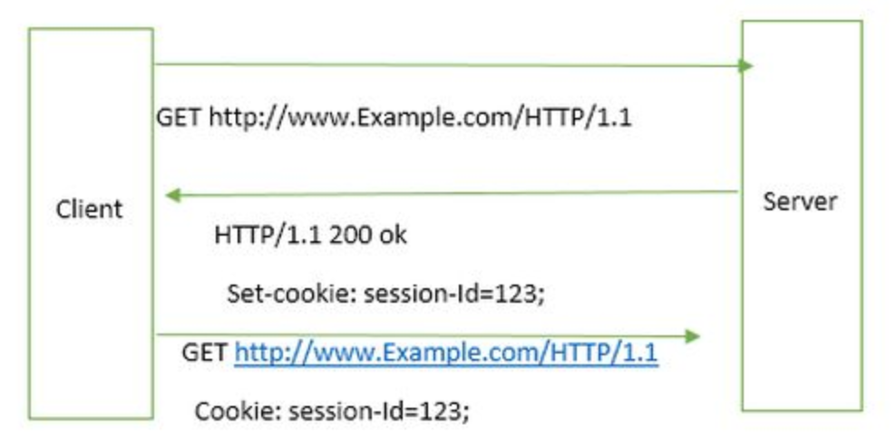
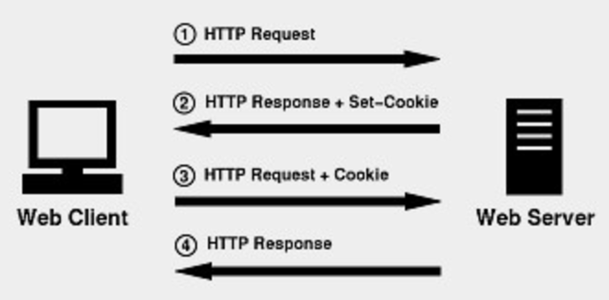
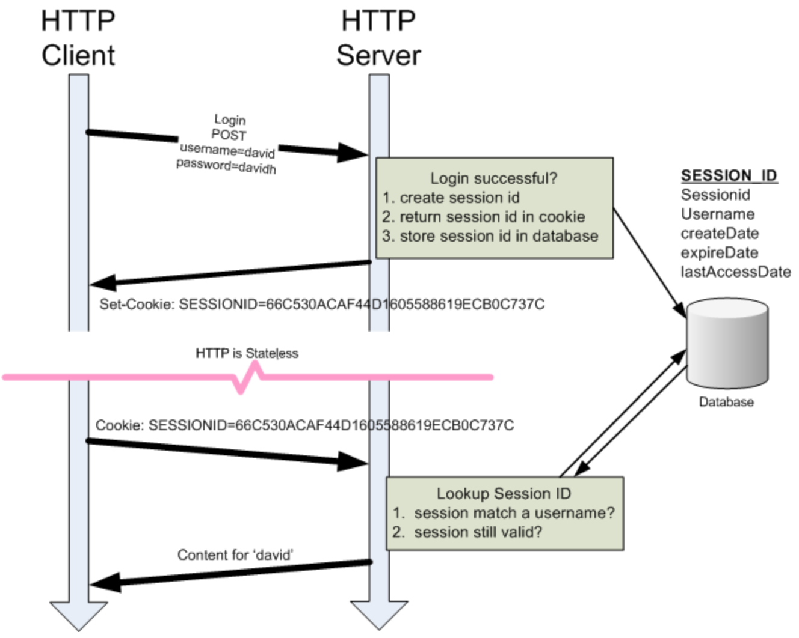

# (2018.01.29)

## TIL

### stateful / stateless

#### 1. 무상태 ? 상태 ?
#### 2. server - client 는 어떻게 정보를 주고 받는가 ?

---
#### 1. 무상태 ? 상태 ?

웹 프로그래밍 반복주기 학습중에 `stateful / stateless` 상태에 대한 학습을 하게 되었다.
기본적으로 HTTP 프로토콜은 상태를 가질 수 없는 `무상태 프로토콜(stateless)` 이다.

> 그렇다면 이 둘의 차이는 무엇일까?
>   
> stateful : server side 에 client와 server의 연속된 동작 상태정보를 저장하는 형태
>   
> stateless : server side 에 client와 server의 연속된 동작 상태정보를 저장하지 않는 형태

- 이 두 상태를 쉽게 표현하기 위해서, '프로가 되기 위한 웹 기술 입문' 이라는 서적에서는 아래와 같은 예시를 들었다.
  ```
  - 무상태 미용실
  주인: 어떻게 잘라 드릴까요?
  손님: 짧게 잘라 주세요.

  - 상태 유지 미용실
  손님: 평소하고 똑같이 잘라 주세요.
  주인: 알겠습니다.
  ```

따라서 http 에서 각각의 client 요청은 서로 완전히 독립적이고 이전 요청에 의존적이지 않다. 즉, 각각의 요청은 server 가 처리할 수 있도록 하기 위한 모든 정보를 제공해야 한다.

---
#### 2. server - client 는 어떻게 정보를 주고 받는가 ?

그렇다면 무상태에서 server와 client는 어떻게 정보를 주고 받을까 ?
웹서버는 무상태이기 때문에, 지금 이 사용자가 이전에 접속했던 사용자인지 아닌지 기억하지 못한다.
이러한 상태에서 로그인한 상태값을 어떻게 유지할 수 있을까? HTTP는 아주아주 무식한 방법으로
클라이언트를 식별한다. 정보의 흐름을 이해하기 위해 두가지를 알아야 한다.

- 쿠키 (COOKIE)

- 세션 (SESSION)

#### 쿠키 (COOKIE)

서버는 Set-Cookie header 값으로 상태를 유지하고 싶은 값을 클라이언트에 전송한다.
클라이언트는 Set-Cookie에 담겨 있는 값을 꺼내 이후에 발생하는 모든 요청의 Cookie header로 다시 서버에 전송한다.
서버는 클라이언트에서 전송한 Cookie header 값에 따라 이전에 접속한 사용자인지를 판단한다.
이를 그림으로 표현하면 아래와 같다.


<그림 1. cookie를 통한 통신 - 출처 : nextstep>


<그림 2. cookie를 통한 통신2>

그렇지만 이와같은 방식은, 쿠키에 대한 정보를 매 헤더(Http Header)에 추가하여 보내기 때문에 상당한 트랙픽을 발생시키고, 결제정보등을 쿠키에 저장하였을때 쿠키가 유출되면 보안에 대한 문제점도 발생할 수 있다. 특히나 이러한 보안 문제 때문에 SESSION 의 등장은 더욱 필요한 것 같다.

#### 세션 (SESSION)

세션은 기본으로 Cookie를 사용하는 방법은 동일하다. 단, 세션은 클라이언트와 서버간에
저장하고 싶은 데이터를 서버에 저장한 후 이 값에 대한 유일한 ID 값(Session ID라고 한다.)
을 발급한다. 클라이언트와 서버 사이는 Cookie를 통해 Session Id만 주고 받는다.
서버는 클라이언트가 전송한 Session Id를 활용해 서버에 저장된 값을 꺼내와 사용한다.


<그림 3. session을 통한 통신 - 출처 : nextstep>
