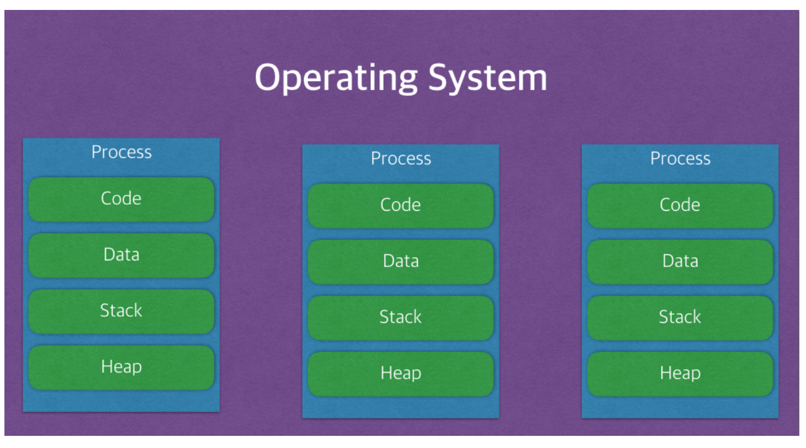
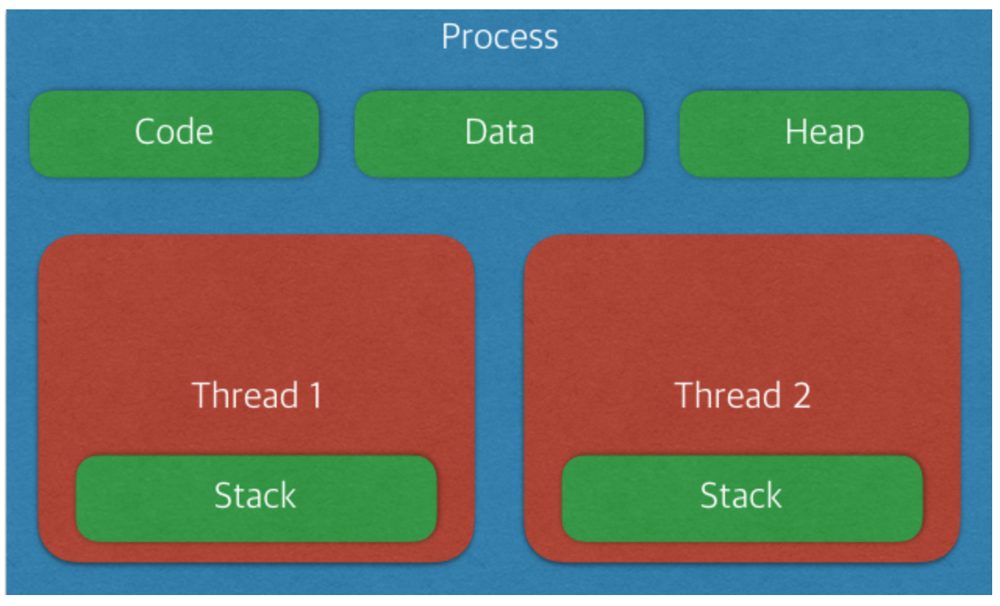

# TIL (운영체제)

# 2018.02.01 ~ 2018.02.23 (예정)

## 1. 프로세스와 스레드 (process & thread)

## 2. 멀티스레드

## 3. 스케줄러

## 4. CPU 스케줄러

## 5. 동기와 비동기의 차이

## 6. 프로세스 동기화

## 7. 메모리 관리 전략

## 8. 가상 메모리

## 9. 캐시의 지역성

---
## 1. 프로세스와 스레드 (process & thread)

### 프로세스 (process)

- 프로세스란 ?

  실행 중인 프로그램으로 디스크로부터 메모리에 적재되어 CPU의 할당을 받을 수 있는(운영체제의 제어를 받는)것을 말한다. 운영체제로부터 주소 공간, 파일, 메모리 등을 할당받으며 이것들을 총칭하여 프로세스라고 한다.

  해당 프로세스가 사용하고 있는 메모리 영역(자신의 주소 공간)이 존재함을 의미하고, 프로세서 할당(점유)시간과 메모리, 파일, 입/출력장치 등의 자원이 필요하며, 이들은 프로세스 생성 및 실행 시 할당된다.

  현재의 활동 상태를 나타내는 프로그램 카운터와 프로세서의 현재 활동(레지스터 내용)을 포함한다.

- 프로세스의 특징은 ?

  - 프로세스 제어 블록(Process Control Block, PCB)

    PCB는 특정 프로세스에 대한 중요한 정보를 저장 하고 있는 운영체제의 자료구조이다. 운영체제는 프로세스를 관리하기 위해 프로세스의 생성과 동시에 고유한 PCB를 생성 한다. 프로세스는 CPU를 할당받아 작업을 처리하다가도 프로세스 전환이 발생하면 진행하던 작업을 저장하고 CPU를 반환해야 하는데, 이때 작업의 진행 상황을 모두 PCB에 저장하게 된다. 그리고 다시 CPU를 할당받게 되면 PCB에 저장되어있던 내용을 불러와 이전에 종료됐던 시점부터 다시 작업을 수행한다. 이러한 과정을 `context Switching` 이라고 한다.
    PCB는 Code, Data, Stack, Heap의 구조로 되어있는 독립된 메모리 영역이다.

    - 실행 스택(Stack)
       : 호출된 프로시저(함수)의 복귀 주소와 지역 변수 등의 일시적인 데이터 저장하는 영역
    - 실행 힙(Heap)
       : 텍스트(코드) 영역과는 별도로 유지되는 자유 영역
    - 데이터(정적 변수)
       : 프로세스 실행 중 동적으로 할당 받는 영역, 전역 또는 정적 변수 저장
    - 텍스트(코드)
       : 프로세서가 실행하는 코드 저장

       

       **<그림 1> 프로세스 실행 시, 할당받는 메모리 영역  (이미지 출처 : https://magi82.github.io/process-thread/)**

### 스레드 (thread)

- 스레드란 ?

  프로세스 내에서 실행되는 여러 흐름의 단위. 즉, 프로세스의 실행 단위라고 볼 수 있다. 각각의
  스레드는 프로세스 내의 주소 공간이나 자원을 공유할 수 있다. 위에서 설명한 `context Switching`은 사실 프로세스가 가지고 있는 스레드를 처리하는 과정이다.

- 스레드의 특징은 ?

  스레드는 프로세스 내에서 각각 Stack만 따로 할당을 받고 Code, Data, Heap 영역을 공유한다.

  - 스택을 스레드마다 독립적으로 할당하는 이유

    스택은 함수 호출 시 전달되는 인자, 되돌아갈 주소값 및 함수 내에서 선언하는 변수 등을 저장하기 위해 사용되는 메모리 공간이므로 스택 메모리 공간이 독립적이라는 것은 독립적인 함수 호출이 가능하다는 것이고 이는 독립적인 실행 흐름이 추가되는 것이다. 따라서 스레드의 정의에 따라 독립적인 실행 흐름을 추가하기 위한 최소 조건으로 독립된 스택을 할당한다.

  

  **<그림 2> thread 의 구조 (이미지 출처 : https://magi82.github.io/process-thread/)**

  이러한 구조로 인해 스레드는 다음의 특징을 가진다.

  - 장점

    메모리를 공유하여 독립적인 프로세스와는 달리 스레드간 데이터를 주고 받는것이 간단하고 시스템 자원 소모가 줄어든다.(응답 시간 또한 단축 된다.)

    그리고 멀티프로세싱의 단점인 Context Switching의 오버헤드에 대한 부분을 해결해 준다.
    프로세스와는 달리 Code, Data, Heap 영역을 공유하므로 Stack 영역만 처리를 하면 되고
    그 결과 처리 비용이 감소하게 된다.

    더군다나 프로세스 Context Switching의 경우 캐쉬 메모리를 초기화 하게 되지만
    스레드는 메모리를 공유하므로 꽤 큰 처리 비용이 드는 초기화를 할 필요가 없어진다.

  - 단점

    여러 스레드가 동시에 작업을 하다보면 공유된 데이터를 서로 사용하다가 충돌이 일어날 가능성이 크다.

### Reference
- https://github.com/JaeYeopHan/Interview_Question_for_Beginner
- https://magi82.github.io/process-thread/

---
