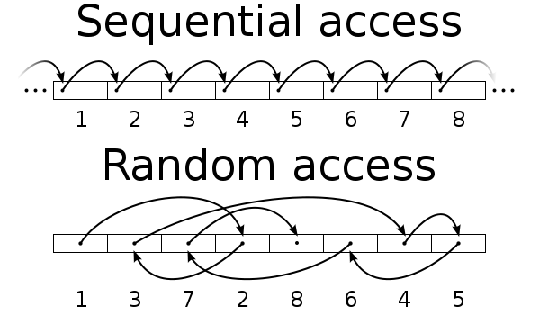

# TIL (자료 구조)

# 2018.02.01 ~ 2018.02.23 (예정)

## 1. 배열과 연결 리스트 (Array vs LinkedList)

## 2. 스택과 큐 (Stack and Queue)

## 3. 트리 (Tree)

## 4. Binary Heap

## 5. Red Black Tree

## 6. HashTable

## 7. Graph

---
## 1. 배열과 연결 리스트

### Array

가장 기본적인 자료구조인 Array 자료구조는, 논리적 저장 순서와 물리적 저장 순서가 일치한다. 따라서 인덱스(index)로 해당 원소(element)에 접근할 수 있다. 그렇기 때문에 찾고자 하는 원소의 인덱스 값을 알고 있으면 Big-O(1)에 해당 원소로 접근할 수 있다. 즉 random access 가 가능하다는 장점이 있는 것이다.

- 추가 1) random access 란 ?

  데이터의 어느 원소라도 접근할 수 있는 능력을 말하며, 더 정확하게는 직접 액세스(direct access)라고 한다. 일반적으로 순차 액세스(sequential access)와 대조된다.

  

  <그림 1> 2가지 access 비교 (sequential vs random)

  이미지 출처 : 위키피디아 (https://en.wikipedia.org)

- 추가 2) Big-O 표기법

  계산 복잡도 이론에서 사용되는 점근 표기법. 컴퓨터 과학에서는 주로 입력 데이터의 크기와 알고리즘의 소요 시간 또는 메모리의 상관관계를 나타내지만, 엄밀히는 임의의 함수에 대하여 `함수의 입력값(정의역의 원소)이 커짐에 따라 그 출력값(그 원소의 상)이 얼마나 빠르게 커지는가`를 표현한다.

  

  <그림 2> Big-O 에 따른 그래프 형태

  이미지 출처 : http://bigocheatsheet.com/

하지만 삭제 또는 삽입의 과정에서는 해당 원소에 접근하여 작업을 완료한 뒤(O(1)), 또 한 가지의 작업을 추가적으로 해줘야 하기 때문에, 시간이 더 걸린다. 만약 배열의 원소 중 어느 원소를 삭제했다고 했을 때, 배열의 연속적인 특징이 깨지게 된다. 즉 `빈 공간이 생기는 것`이다. 따라서 삭제한 원소보다 큰 인덱스를 갖는 원소들을 `shift해줘야 하는 비용(cost)이 발생`하고 이 경우의 시간 복잡도는 O(n)가 된다. 그렇기 때문에 Array 자료구조에서 삭제 기능에 대한 time complexity의 worst case는 O(n)이 된다.

삽입의 경우도 마찬가지이다. 만약 첫번째 자리에 새로운 원소를 추가하고자 한다면 모든 원소들의 인덱스를 1씩 shift 해줘야 하므로 이 경우도 O(n)의 시간을 요구하게 된다.

### LinkedList (연결 리스트)

이 부분에 대한 문제점을 해결하기 위한 자료구조가 linked list이다. 각각의 원소들은 자기 자신 다음에 어떤 원소인지만을 기억하고 있다. 따라서 이 부분만 다른 값으로 바꿔주면 삭제와 삽입을 O(1) 만에 해결할 수 있는 것이다.

하지만 LinkedList 역시 한 가지 문제가 있다. 원하는 위치에 삽입을 하고자 하면 원하는 위치를 Search 과정에 있어서 첫번째 원소부터 다 확인해봐야 한다는 것이다. Array와는 달리 논리적 저장 순서와 물리적 저장 순서가 일치하지 않기 때문이다. 이것은 일단 삽입하고 정렬하는 것과 마찬가지이다. 이 과정 때문에, 어떠한 원소를 삭제 또는 추가하고자 했을 때, 그 원소를 찾기 위해서 O(n)의 시간이 추가적으로 발생하게 된다.

결국 linked list 자료구조는 search에도 O(n)의 time complexity를 갖고, 삽입, 삭제에 대해서도 O(n)의 time complexity를 갖는다. 그렇다고 해서 아주 쓸모없는 자료구조는 아니기에, 우리가 학습하는 것이다. 이 Linked List는 Tree 구조의 근간이 되는 자료구조이며, Tree에서 사용되었을 때 그 유용성이 드러난다.

### Reference

- https://github.com/JaeYeopHan/Interview_Question_for_Beginner

---
## 2. 스택과 큐 (Stack and Queue)

### Stack

 
  

선형 자료구조의 일종으로 Last In First Out (LIFO). 즉, 나중에 들어간 원소가 먼저 나온다. 이것은 Stack의 가장 큰 특징이다. 차곡차곡 쌓이는 구조로 먼저 Stack에 들어가게 된 원소는 맨 바닥에 깔리게 된다. 그렇기 때문에 늦게 들어간 녀석들은 그 위에 쌓이게 되고 호출 시 가장 위에 있는 녀석이 호출되는 구조이다.

### Queue

 
  

선형 자료구조의 일종으로 First In First Out (FIFO). 즉, 먼저 들어간 놈이 먼저 나온다. Stack 과는 반대로 먼저 들어간 놈이 맨 앞에서 대기하고 있다가 먼저 나오게 되는 구조이다. 참고로 Java Collection에서 Queue는 인터페이스이다. 이를 구현하고 있는 Priority queue등을 사용할 수 있다.
