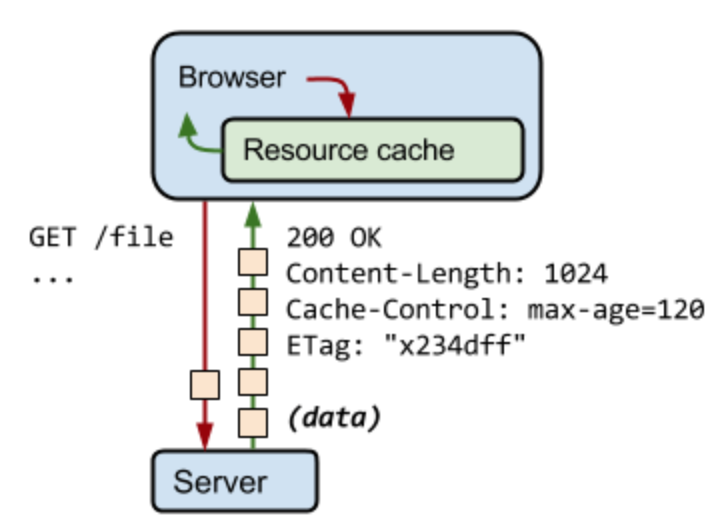

# TIL (네트워크)

# 2018.02.01 ~ 2018.02.23 (예정)

## 1. GET, POST 비교

## 2. TCP 3-way-handshake

## 3. TCP와 UDP의 비교

## 4. HTTP와 HTTPS

## 5. DNS Round Robin 방식

## 6. 웹 통신의 큰 흐름

---
## 1. GET, POST 비교

둘 다 HTTP프로토콜을 이용해서 서버에 무엇인가를 요청할 때 사용하는 방식이다. 하지만 둘의 특징을 제대로 이해하여 기술의 목적에 맞게 알맞은 용도에 사용해야한다.

- GET

  우선 GET 방식은 요청하는 데이터가 HTTP Request Message의 Header 부분의 url에 담겨서 전송된다. 때문에 url 상에 ? 뒤에 데이터가 붙어 request를 보내게 되는 것이다.
  > ex)
  >
  > https://www.studyNetwork.com/login.html?id=koo&passwd=123!

  이러한 방식은 url이라는 공간에 담겨가기 때문에 전송할 수 있는 데이터의 크기가 제한적이다. 또 보안이 필요한 데이터에 대해서는 데이터가 그대로 url에 노출되므로 GET방식은 적절하지 않다. (ex. password)

  GET은 가져오는 것이다. 서버에서 어떤 데이터를 가져와서 보여준다거나 하는 용도이지 `서버의 값이나 상태 등을 변경하지 않는다`. SELECT 적인 성향을 갖고 있다고 볼 수 있는 것이다.

- POST

  POST 방식의 request는 HTTP Message의 Body 부분에 데이터가 담겨서 전송된다. 때문에 바이너리 데이터를 요청하는 경우 POST 방식으로 보내야 하는 것처럼 데이터 크기가 GET 방식보다 크고 보안면에서 낫다.(하지만 보안적인 측면에서는 암호화를 하지 않는 이상 고만고만하다.)

  POST는 GET과는 다르게 서버의 값이나 상태를 변경하기 위해서 또는 추가하기 위해서 사용된다.

- 추가적인 차이점

  부수적인 차이점을 좀 더 살펴보자면 GET 방식의 요청은 브라우저에서 Caching 할 수 있다. 때문에 POST 방식으로 요청해야 할 것을 '보내는 데이터의 크기가 작고 보안적인 문제가 없다.'는 이유로 GET 방식으로 요청한다면 기존에 caching 되었던 데이터가 요청될 가능성이 존재한다. 때문에 `목적에 맞는 기술을 사용해야 하는 것`이다.

- 추가 1) caching 이란 ?

  캐싱이란, 데이터를 캐시(임시 저장 영역)에 저장하는 프로세스이다. 네트워크를 통해서 서버에
  요청을 하고, 데이터를 받아오는 것은 굉장히 느린 동시에 비용이 많이 든다. 크기가 큰 요청과
  응답은 클라이언트와 서버 사이에 많은 왕복을 필요로 하므로, 브라우저가 처리할 수 있게 되는 시기가 지연되고 방문자에 대한 데이터 비용도 발생한다. 또한 한번 접속했던 데이터들을 얼마
  되지않은 시간 후에 다시 접속할 때, 매 시도마다 서버에 데이터를 요청한다면, 비용과 시간적으로 큰 손실이 생길것이다. 이를 막아주는 기술이 바로 캐싱이다.

  즉, 요청에 대한 데이터를 응답받을 때 캐시에 저장해두고 다시 그 자원이 필요한 경우에 캐시에서 데이터를 가져옴으로써 비용을 절약해주는것이 바로 캐싱이다.

  

  <그림 1> caching

  이미지 출처 : https://developers.google.com/web/fundamentals/performance/optimizing-content-efficiency/http-caching?hl=ko

  ### Reference

  - https://github.com/JaeYeopHan/Interview_Question_for_Beginner
---
