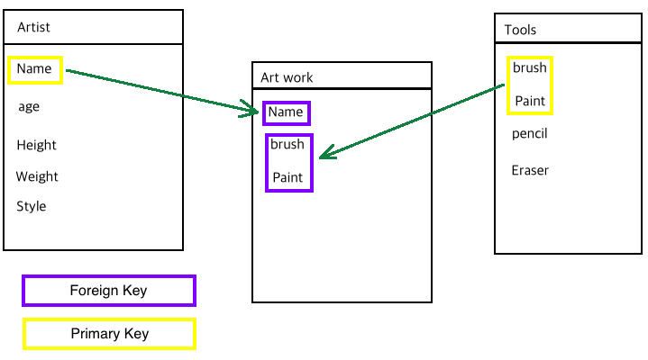

# (2018.03.05 ~ 03.06)

## TIL

1. JWP 반복주기 복습
  - 1) remind
  - 2) (DATABASE) 기본키(primary key) / 외래키(foreign key) 정리

---
### 1-1) remind

- Service layer

  UI <- Controller - Service (controller 의 중복 부분을 담는다.) - Repository -> DB

- DATABASE 에 DATA 를 삽입하거나, 조회하기 위해 Repository 인터페이스(클래스)를 추가한다.

- DATA를 를 관리하는 클래스들은 domain package 하위에 저장하는것이 보편적.

- 현재의 클래스가 DATABASE 에 연관된 클래스임을 알려주는 annotation을 사용해야 인식가능하다. (@Entity)

- 클래스 내부의 각각의 데이터들을 고유하게 식별하기 위해 primary key 가 있다. 이렇듯 각 데이터들에게 primary key를 지정해주는 annotation을 사용해준다. (@Id)

  > 하나의 primary key가 DATABASE에서 자동으로 1씩 증가하게하여 저장하는 annotatio
  사용도 필요. (@GeneratedValue)

  > 각각의 field를 default값이 아닌 다른 값으로 다루고 싶을때, `@Column(nullable=false, length=20)` 와 같이 사용한다.

---
### 1-2) (DATABASE) 기본키(primary key) / 외래키(foreign key) 정리

- 기본키 : 한 테이블을 구성하는 컬럼들 중, 모든 데이터가 고유의 값을 가져야만 하는 칼럼이다. 값이 겹칠 수 없다. (각각의 데이터를 유일하게 구분하는 키)

- 외래키 : 각 테이블 간의 연결을 만들기 위해서 다른 테이블에서 참조하는 기본키 칼럼이다.

  

---
```html
<input type="hidden" name="_method" value="DELETE">
```
html 문서에서 `name="_method"` 부분은 PutMapping 과 DeleteMapping 기능을 사용할 수 있게 해준다.

---
mustache 와 다르게 handlebars 에서는 무조건 getter() 메서드를 필요로 한다.
(mustache 는 로컬변수 이름을 이용하여 사용 가능하지만,)

---
