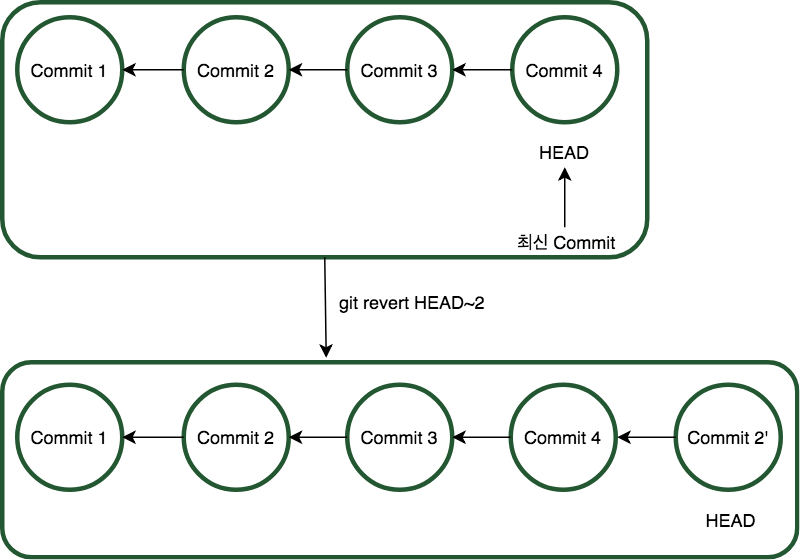

# Git 기초

---
## 기초 지식 / Git의 장단점

- Linux 개발자인 Linus Benedict Torvalds(이하 리누스 토르발스)가 개발했다. 그는 기존 Version Control System(VCS)가 맘에 들지 않아 2주만에 개발을 완료했다.

- Linux 오픈소스는 타 오픈소스에 비해 소스코드의 크기가 크고, 복잡하다는 특징이 있다. 따라서 굉장히 복잡한 Work Flow를 관리하기  쉽고, 대용량의 소스코드를 신속하게 업로딩할 수 있는 툴이 필요했나보다.

- 장점
  - 오프라인에서 사용이 가능하다.
  - 성능(속도)이 매우 좋다.
  - 브랜치 관리가 잘 된다. (== Work Flow 관리가 쉬워 협업에 유리하다.)

- 단점
  - 배우기가(사용하기가) 어렵다.

---
## Git 기본 명령어 설명

- add : Working tree에 있는 파일을 stage에 올리는 것.
- commit : stage에 있는 `file들`을 `묶어서` Local 저장소에 `저장`하는 것
  - commit의 결과로 1개의 commit이 생성된다.
  - 생성된 커밋은 쉽게말해 내 Working Directory의 특정 시점(commit 한 시점)의 `SNAPSHOT`이라고 볼 수 있다.

  
  - 이처럼 Commit을 하면, 새로 생성된 Commit3은 HEAD가 가리키는 Commit2를 가리키게 되고, 바로 자신이 HEAD가 된다.

- reset : Commit 4 의 이력이 사라지고, 되돌릴 수 없다. (물론 무조건 되돌릴 수 없다고 할 순 없다. 복구하는 방법은 있지만, 무조건 복구할 수 있는것은 아니므로 없다고 하겠다.)

- revert : 목표가 되는 Commit을 현재 HEAD 이후에 복제한다.
> 이 때문에 충돌이 나기 쉽다.

- checkout : HEAD를 이동한다.
  - 기본 form은 `git checkout <commit id>` 이지만, 우리는 `git checkout <branch 이름>` 으로 사용한다. 왜 그럴까?
    > branch는 commit의 참조이기 때문이다.

  - 그림에서 `*`이 의미하는 것은 그 브랜치가 HEAD라는 표시이다. 이 상태에서 checkout을 한 결과, HEAD가 Commit 2로 이동했다.

  - checkout을 하면, HEAD가 변경되고, 나의 Working Directory가 HEAD가 이동한 Commit의 상태로 변경된다. (Commit은 특정 시점의 SNAPSHOT이라고 설명한 바 있다.)

- rebase : 현재 브랜치를 목적 브랜치 아래에 복제하고, 기존의 브랜치는 삭제한다.
  - 이와 같이 사용하면, 충돌이 빈번하게 일어나게 된다.
  - 하지만, 한 라인으로 커밋 이력이 정리되기 때문에 보기에는 예뻐진다는 장점이 있다. (나머지 모든것이 단점인 것 같다..)

- merge : 두 Commit 을 합해서 새로운 Commit 을 생성한다.

- push : local 저장소에 있는 file들을 원격 저장소로 올리는 행위. (변동 사항만)
  > 기본 form : git push <저장소 이름> <브랜치 이름>

- pull : 2가지 작업을 실시한다.
  - 원격 저장소에 있는 파일을 local 저장소로 가져온다.
  - HEAD Commit과, 브랜치의 가장 최근 Commit을 `merge`한다.

- fetch : 원격 저장소와 local 저장소를 동기화한다.
  > local에 없는 Commit을 가져온다.

- status : Working Directory와 Stage를 비교하여 다른 것을 보여준다.
