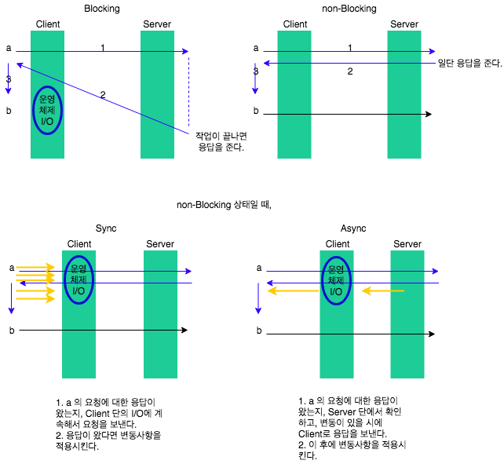

# POBI 강의 Process / Thread

---
## 목차

- Process vs Thread

- sync vs async

- multi thread vs single thread

- blocking vs non-blocking

---
### Process vs Thread

- 운영체제 전 분야를 다 학습하기는 어렵지만, 프로세스와 쓰레드에 대해서는 확실히 학습하자.
- terminal 에서 process 보는 명령어 = 'top'
- heap 과 stack 가 중요하다.

#### 프로세스는 실행중인 프로그램이다.

- heap = 메모리 공유 가능 / stack = 메모리 공유 불가
-

#### 스레드는 CPU 이용의 기본 단위로서 독립적으로 실행되는 코드 집합이다.

- 하나의 프로세스 내에는 반드시 하나 이상의 스레드가 존재한다.

---
추가 )
### context 란 ?

- 현재 프로그램이 실행될 때의 메모리 영역들. (어느 라인까지 실행되었을 때의 스레드의 정보들. 다른 스레드를 동작시키기 전 까지의 정보를 가진다.)
- 어디까지 실행됬는지에 대한 정보를 담고있고, 그 시점에 메모리 상에서 관리하고 있는 메모리 정보들을 모두 컨텍스트라고 한다.

### context switching 이란 ?

-

---
### multi thread vs single thread

- 멀티스레드의 단점
  - 메모리 이슈
  - 컨텍스트 스위칭 이슈

- 멀티스레드의 단점을 보완하기 위해 서버를 N대로 두고 여러명의 사용자를 동시에 처리할 수 있다. 하지만, 동시에 접속하는 등의 작업은 가능했지만, 놀고있는 서버들이 발견되었다. 왜일까?

- 어딘가로 요청을 보내두고, 기다리는데에 대부분의 시간을 투자하고 있었다. 이를 보완하기 위해 다시 발전하고 있는 것이 싱글스레드이다.

- 싱글스레드를 async + non-blocking 방식으로 동작시키면서 발전하게 되었다.
- js 에서 ajax나, setTimeOut / setInterval 등 실행 시간이 긴 프로그램들은 async, non-blocking 으로 동작시키고, 시간이 얼마 안걸리는 부분은 blocking으로 동작시킨다.

- 멀티스레드 프로그래밍에서는, 공유되는 heap 메모리를 얼마나 효율적으로 잘 공유할지에 대해 항상 고민해야한다.
- 싱글스레드 프로그래밍에서는, async, non-blocking 으로 동작하는 부분에서 장애가 나면 서버 전체가 뻗기 때문에 이 부분을 가장 중요하게 생각해야 한다.

---
### I/O단에서의 sync vs async / blocking vs non-blocking

- 프로그램의 성능은 I/O에서 대부분 결정난다. (파일을 읽어오고 쓰고 등에 소모되는 시간)

- 그림으로 설명
 

---
### application 단에서의 sync vs async

- async : 스레드 하나에서 하던 일을 다른 스레드로 일을 넘긴 후, 원래의 스레드가 다른일을 병행할 수 있도록 처리하는 것.

---
### 마치며

- 강의에서 가장 중요하고, 실제 application 개발에 가장 도움이 되는 부분은 application단에서의 sync / async에 대해 아는 것이다.

- 추 후, 경력 개발자로 성장하기에 필요한 부분은 운영체제 학습이다.

- 더 깊이있게 알면 좋지만, 현재 단계에서는 최소 이정도 깊이만 알고있자!

-
